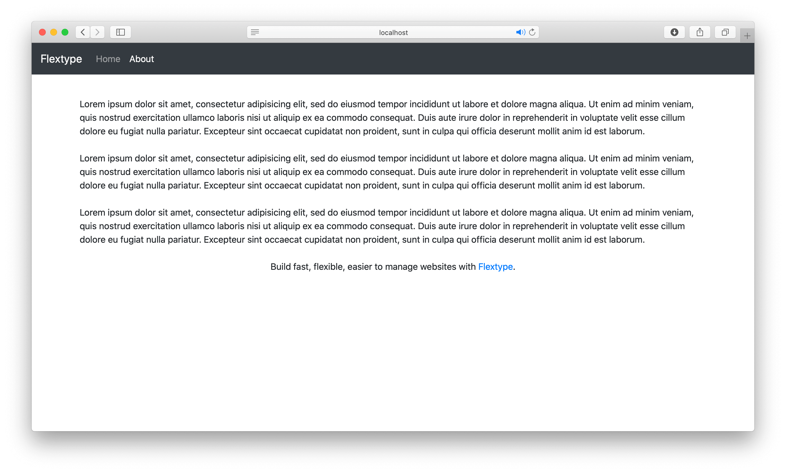

<h1 align="center">Bootstrap theme for <a href="https://flextype.org/">Flextype</a></h1>

    

## Features

* Fully Responsive.
* Cross browser compatible.
* Powered by [Twitter Bootstrap Framework](https://getbootstrap.com)

## Dependencies

The following dependencies need to be downloaded and installed for Bootstrap Site Theme.

| Item | Version | Download |
|---|---|---|
| [flextype](https://github.com/flextype/flextype) | 0.9.16 | [download](https://github.com/flextype/flextype/) |
| [site](https://github.com/flextype-plugins/site) | >=1.0.0 | [download](https://github.com/flextype-plugins/site/releases) |

## Installation

1. Download & Install all required dependencies.
2. Create new folder `/project/themes/bootstrap`
3. Download Bootstrap Site Theme and unzip theme to the folder `/project/themes/bootstrap`
4. Update setting `theme` with new value `bootstrap` in `/project/config/plugins/site/settings.yaml`

The theme by itself is useful, but you may have an easier time getting up and running by installing a project demo content for this theme, it is placed in the `_project` folder. The Bootstrap Site Project demo content contains: sample content, fieldsets for [Admin Panel Plugin](https://github.com/flextype-plugins/admin). Just copy `_project` folder content into your project folder.

## LICENSE
[The MIT License (MIT)](https://github.com/flextype-themes/bootstrap/blob/master/LICENSE.txt)
Copyright (c) 2021 [Sergey Romanenko](https://github.com/Awilum)
