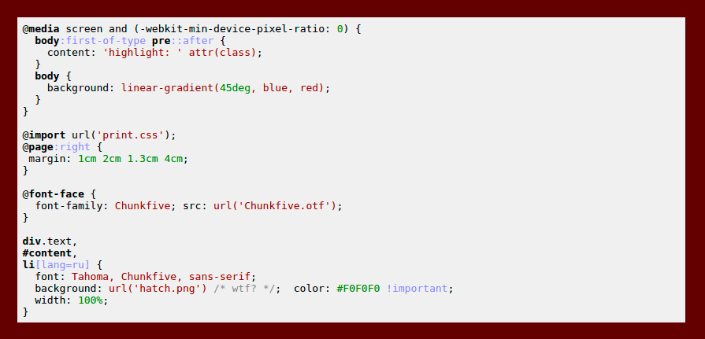

# Highlight Plugin for [Flextype](http://flextype.org/)


[](https://github.com/flextype-plugins/highlight/blob/master/LICENSE.txt)

  

Highlight plugin for [Flextype](https://github.com/flextype/flextype) adds a powerful code highlighting functionality with [Highlight.js](https://highlightjs.org/)

* 176 languages and 79 styles [(live demo)](https://highlightjs.org/static/demo/)   
* automatic language detection
* multi-language code highlighting
* available for node.js
* works with any markup
* compatible with any js framework

## Installation
1. Unzip plugin to the folder `/site/plugins/`
2. Go to `/site/config/site.yml` and add plugin name to plugins section.
3. Save your changes.

Example:
```
...
plugins:
  - highlight
```


## Usage in the pages

    ```php
    function foo($attributes) {
        // Extract attributes
        extract($attributes);

        // text
        if (isset($text)) $text = $text; else $text = '';

        // return
        return $text;
    }
    ```

## Settings
```yaml
enabled: true  # or `false` to disable the plugin
theme: monokai # or other from the list below
```

### Themes
Check out a [live demo](https://highlightjs.org/static/demo/) of these themes!

|                        |                          |                           |
| :--------------------- | :--------------------    | -----------------------   |
| arta                   | ascetic                  | atelier-dune.dark         |
| atelier-dune.light     | atelier-forest.dark      | atelier-forest.light      |
| atelier-heath.dark     | atelier-heath.light      | atelier-lakeside.dark     |
| atelier-lakeside.light | atelier-seaside.dark     | atelier-seaside.light     |
| brown_paper            | codepen-embed            | color-brewer              |
| dark                   | default                  | docco                     |
| far                    | foundation               | github                    |
| googlecode             | hybrid                   | idea                      |
| ir_black               | kimbie.dark              | kimbie.light              |
| learn                  | magula                   | mono-blue                 |
| monokai_sublime        | monokai                  | obsidian                  |
| paraiso.dark           | paraiso.light            | pojoaque                  |
| railscasts             | rainbow                  | school_book               |
| solarized_dark         | solarized_light          | sunburst                  |
| tomorrow-night-blue    | tomorrow-night-bright    | tomorrow-night-eighties   |
| tomorrow-night         | tomorrow                 | vs                        |
| xcode                  | zenburn                  |                           |
| agate                  | androidstudio            | atelier-cave.dark         |
| atelier-cave.light     | atelier-estuary.dark     | atelier-estuary.light     |
| atelier-plateau.dark   | atelier-plateau.light    | atelier-savanna.dark      |
| atelier-savanna.light  | atelier-sulphurpool.dark | atelier-sulphurpool.light |
| darkula                | github-gist              | pojoaque                  |
| school_bank            |                          |                           |

## License
See [LICENSE](https://github.com/flextype-plugins/highlight/blob/master/LICENSE)
